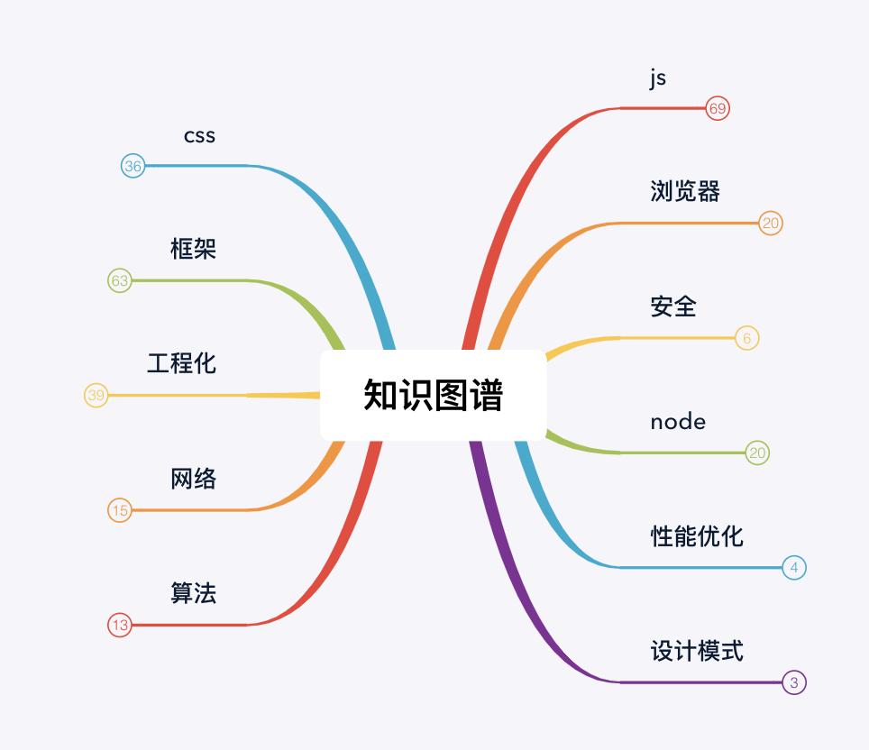

作为一个在互联网公司面一次拿一次 Offer 的面霸，通过这一套体系化的前端知识点，拿了多个大厂offer：阿里、字节跳动、拼多多、快手等

为什么很多前端同学觉得前端知识很乱，因为他们都没有将知识进行分类学习，导致整个的知识点非常凌乱，盲目的刷面经导致无法进入心仪的公司，我决定将前端知识常考题目以问答的形式进行体系化的整理，希望能帮助各位读者面试势如破竹，疯狂收割大厂Offer！

我会根据前端的知识体系写这个系列，很多细节的点，可能想得不是很完善，大家可以去<a href="#公众号">【公众号】</a>获取最新文章或者加我<a href="#公众号">【微信】</a>提意见（别忘记 Star 哟）。

<!--  -->

## 目录

* [JavaScript基础知识](./requestion/js.md)
    * [基础知识](./requestion/js.md#基础知识)
    * [重要概念](./requestion/js.md#重要概念)
    * [手写函数](./requestion/js.md#手写函数)
* [css必懂知识点](./requestion/css.md)
    * [BFC是什么有什么作用](./requestion/css.md#BFC)
    * [盒模型](./requestion/css.md#盒模型)
    * [选择器优先级](./requestion/css.md#选择器优先级)
    * [清浮动](./requestion/css.md#清浮动)
    * [层叠上下文](./requestion/css.md#层叠上下文)
    * [css性能优化](./requestion/css.md#css性能优化)
* 前端框架
    * [vue高频题](./requestion/vue.md)
        <!-- * [vue为什么实例上可以直接访问到data中的值](./requestion/vue.md#基础知识)
        * [什么是MVVM、MVC](./requestion/vue.md#什么是MVVM、MVC)
        * [如何实现数据响应](./requestion/vue.md#如何实现数据响应)
        * [vue中如何实现数组监听](./requestion/vue.md#vue中如何实现数组监听)
        * [nextTick回调为什么会在dom更新后才触发](./requestion/vue.md#nextTick回调)
        * [vue的生命周期](./requestion/vue.md#vue的生命周期)
        * [computed、watcher](./requestion/vue.md#computed、watcher)
        * [v-if和v-show的区别](./requestion/vue.md#v-if和v-show的区别)
        * [为什么data用的是一个函数](./requestion/vue.md#为什么data用的是一个函数)
        * [v-model如何实现的](./requestion/vue.md#v-model如何实现的)
        * [@on事件的处理](./requestion/vue.md#@on事件的处理)
        * [vue-router实现原理](./requestion/vue.md#vue-router实现原理)
        * [打包多页](./requestion/vue.md#打包多页)
        * [预渲染与服务端渲染](./requestion/vue.md#预渲染与服务端渲染)
        * [proxy和Object.definedProperty](./requestion/vue.md#proxy和Object.definedProperty)
        * [vue和react选型](./requestion/vue.md#vue和react选型)
        * [vue组件通信有哪几种方式](./requestion/vue.md#vue组件通信有哪几种方式)
        * [vuex](./requestion/vue.md#vuex)
        * [keep-alive](./requestion/vue.md#keep-alive)
        * [minx和extend](./requestion/vue.md#minx和extend)
        * [虚拟dom和diff算法](./requestion/vue.md#虚拟dom和diff算法)
        * [vue高阶组件](./requestion/vue.md#vue高阶组件)
        * [directives指令](./requestion/vue.md#directives指令)
        * [vue-router生命周期](./requestion/vue.md#vue-router生命周期)
        * [slot](./requestion/vue.md#slot) -->
    * [react高频题](./requestion/react.md)
        <!-- * [函数式组件与类组件有什么不同](./requestion/react.md#函数式组件与类组件有什么不同)
        * [JSX](./requestion/react.md#JSX)
        * [React高阶组件](./requestion/react.md#React高阶组件)
        * [性能优化](./requestion/react.md#性能优化)
        * [Hook](./requestion/react.md#Hook)
        * [生命周期](./requestion/react.md#生命周期)
        * [fiber](./requestion/react.md#fiber)
        * [setState](./requestion/react.md#setState)
        * [redux](./requestion/react.md#redux)
        * [受控组件和非受控组件](./requestion/react.md#受控组件和非受控组件) -->
* 周边生态
    * [webpack](./requestion/webpack.md)
* 前端架构
    * [微前端](./JavaScript/架构/micro-front-end.md)
* [浏览器相关](./requestion/browser.md)
* [性能优化相关](./requestion/performance.md)
* [网络相关高频题](./requestion/network.md)
* [node高频题](./requestion/node.md)
    <!-- * [pm2](./requestion/node.md#pm2)
    * [Cluster](./requestion/node.md#Cluster)
    * [进程守护](./requestion/node.md#进程守护)
    * [Koa中间件实现](./requestion/node.md#Koa中间件实现)
    * [node常用模块](./requestion/node.md#node常用模块)
    * [大文件下载、上传、大文件读取](./requestion/node.md#大文件下载、上传、大文件读取)
    * [pipe](./requestion/node.md#pipe)
    * [commonJS原理](./requestion/node.md#commonJS原理)
    * [查看内存占用情况](./requestion/node.md#查看内存占用情况) -->
* [安全相关](./requestion/safe.md)
    <!-- * [xss攻击](./requestion/safe.md#xss攻击)
    * [CSRF](./requestion/safe.md#CSRF) -->

## 公众号

欢迎关注公众号"全栈精选"，给你推荐更多前端知识、程序员成长方面的知识

